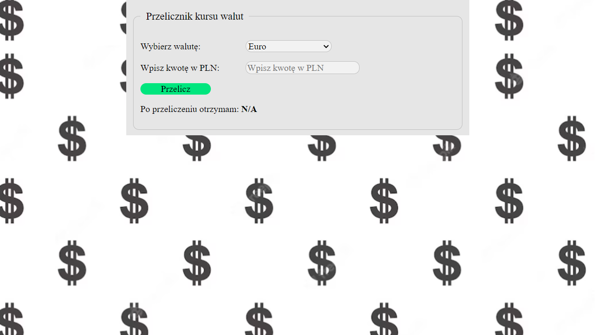

# Przelicznik walut - Wojciech Dziugieł

## linki 
[Demo]https://wojteek7.github.io/currencyCalculator/ 
[Repozytorium]https://github.com/wojteek7/projekt2.git

## opis
Mój drugi projekt na drodze do zostania programistą, podstawowy przelicznik walut wykorzystujący proste formuły javascript.

## screenshot

## technologie

W aplikacji zostały użyte podstawowe elementy HTML, takie jak nagłówki, tabele, listy, stopki, artykuły.   Zastosowany został również CSS aby poprawić estetykę projektu a także JavaScript - głównie gunkcje strzałkowe dla poprawnego działania przelicznika oraz możliwie jak najkrótszego oraz jak najczytelniejszego kodu. 

# English

## links
[Demo]https://wojteek7.github.io/currencyCalculator/  
[Repository]https://github.com/wojteek7/projekt2.git

## description
My second project on the way to be a programmer, basic currency calculator which using simple JavaScript formulas.

## screenshot

Basic HTML elements such as headers, tables, lists, footers, and articles were used in the application.   CSS was also applied to enhance the project's aesthetics, and JavaScript was utilized, mainly arrow functions, to ensure the proper functioning of the converter and to write code that is as concise and readable as possible.
